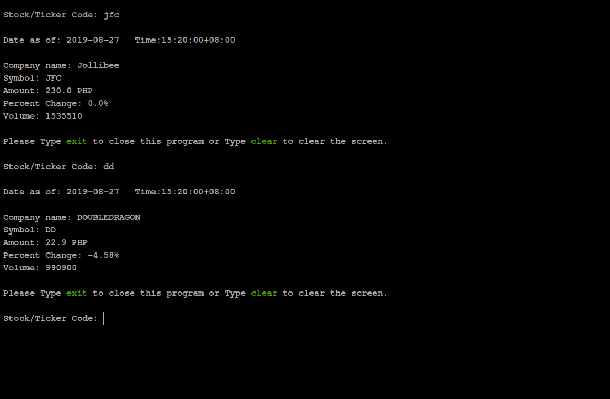

# pse-cli

#### This is a simple cli program that can be use to view PSE stock prices via the terminal.
#### PSE stands for Philippine Stock Exchange.
#### This program was built using Philippine Stock Exchange Composite Index RESTful API.
#### Please see full API documentation via this page http://phisix-api4.appspot.com/.
#### This program uses an RSS feed for realtime result.

 

## Requirement 
- This will only work for Python version 3+ 

 

### Install Instruction: 

1. Clone the this repo. 
    #### `https://github.com/rockstartraders/pse-cli`

   If git is not installed just download it then extract it to your pc.. 
 
 2. After cloning go to the directory.

      #### `cd pse-cli`

   3. Change Permission.

      #### `chmod u+x pse.py`
         If permission error occurs you know the drill  [sudo](https://en.wikipedia.org/wiki/Sudo) is the key.

   4. run it. 

      #### `./pse.py` or set the `PATH=$PATH:/path/to/dir` to make it internal.

  ### Possible error : 
   If ever you received an error stating `bad interpreter: No such file or directory in python`, just go ahead and fix the shebang and indicate the Python version that you are using.
   
   Example: 
   ### `#!/usr/bin/python3.6 To #!/usr/bin/python3.7`
   

   Please Note that this will only work on Python Version 3+.  

 

### Screenshot

 ### Output Sample

 
 

